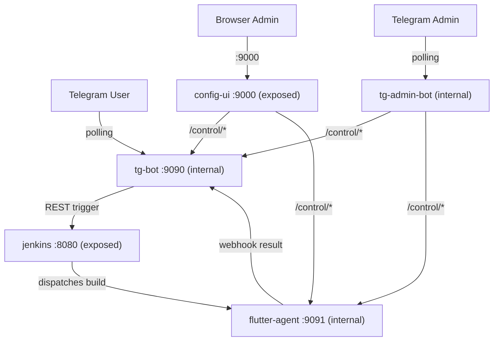

# Jenkins Flutter Bot — AI Agent Guide

This is the core architectural reference for the **jenkins-flutter-bot** monorepo. It loads on every interaction. For detailed guidance on specific topics, see the companion rule files.

---

## What This Project Is

A self-hosted CI/CD ecosystem: a Telegram bot triggers Flutter builds on Jenkins and delivers APKs through Google Drive. Five containerized services coordinate over an internal Docker network.

**It is NOT a build system.** It is a thin orchestration layer around Jenkins. All cloning, compiling, and artifact packaging is delegated to a Jenkins pipeline running on a Flutter-capable agent.

---

## Repository Layout

The monorepo uses a **uv workspace** with two top-level directories for code:

- **`apps/`** — Four deployable Python applications, each with a Dockerfile, `pyproject.toml`, and `src/<package>/` layout.
- **`libs/`** — Two shared workspace libraries consumed by the apps.
- **`infra/`** — Docker Compose files, Dockerfiles, and per-service environment file templates.
- **`scripts/`** — Developer utilities (env example generation, version tagging).

### Apps

| Directory | Package | Role |
|-----------|---------|------|
| `tg-jenkins-bot` | `tg_jenkins_bot` | Telegram bot — build trigger + webhook receiver + Drive upload |
| `config-ui` | `config_ui` | Web dashboard — config CRUD, service control, Drive OAuth, env export |
| `tg-admin-bot` | `tg_admin_bot` | Headless Telegram admin bot — stack management fallback |
| `agent-control` | `agent_control` | HTTP control wrapper for the Jenkins agent subprocess |

### Libs

| Directory | Package | Role |
|-----------|---------|------|
| `config-schema` | `config_schema` | Declarative `FieldDef` dataclass, `resolve_fields()`, `serialize_schema()` |
| `stack-manager` | `stack_manager` | Service control, Drive OAuth, JSON I/O, env export/import, Jenkinsfile generation |

### Naming Conventions

- **Directory names**: `kebab-case` (e.g., `tg-jenkins-bot`, `stack-manager`).
- **Python packages**: `snake_case` matching the directory name (e.g., `tg_jenkins_bot`, `stack_manager`).
- **Source layout**: All apps and libraries use PyPA `src` layout — code lives under `src/<package_name>/`.

---

## Architecture

### Service Topology

Five services on a shared Docker bridge network. Only Jenkins and config-ui are exposed to the host:

### Service Roles

| Service | Port | Exposed | Role |
|---------|------|---------|------|
| `tg-bot` | 9090 | No | Telegram polling bot + FastAPI webhook/control server |
| `config-ui` | 9000 | Yes | Web dashboard for config, service control, Drive OAuth |
| `jenkins` | 8080 | Yes | Standard Jenkins controller (dev/testing — can be external) |
| `flutter-agent` | 9091 | No | Jenkins inbound agent with Flutter/Android SDKs + control API |
| `tg-admin-bot` | — | No | Headless Telegram admin bot for stack management (no HTTP server) |

### Design Principles

1. **Thin Trigger Layer** — The bot owns zero build logic. It triggers Jenkins via REST, registers a `request_id`, and waits for a webhook callback.

2. **HTTP Signal Architecture** — Services coordinate via internal HTTP control APIs (`/control/start`, `/control/stop`, `/control/restart`, `/control/status`, `/control/schema`). No Docker socket mounting. Both `config-ui` and `tg-admin-bot` use these control APIs via a shared `ServiceClient`.

3. **No Docker-out-of-Docker** — `docker.sock` is never mounted into any container. This is intentional for security and portability.

4. **FastAPI Everywhere** — All service APIs use FastAPI: the bot, config-ui, and agent-control. The `tg-admin-bot` is the exception — it runs as a Telegram polling bot only with no HTTP server.

5. **Jenkins-Synced, Bot-Scoped** — The bot queries Jenkins REST API for live build details but only for builds it triggered. It maintains a slim local registry of its own triggered builds — Jenkins owns all build metadata. No information about non-bot-triggered builds is ever exposed to Telegram.

6. **uv Workspace** — Single `pyproject.toml` + `uv.lock` at the root. All members share a unified lockfile. Shared code lives in `libs/`. Dev tools are declared once at the workspace root. The flutter-agent Dockerfile keeps uv in runtime (exception — the base image lacks Python 3.12).

7. **Dual Management Interfaces** — `config-ui` (web dashboard) and `tg-admin-bot` (headless Telegram bot) provide parallel interfaces for stack management. Both depend on `stack-manager` for shared logic. `config-ui` handles browser-redirect Drive OAuth; `tg-admin-bot` provides a manual code-paste headless flow. Both support tarball-based config transfer.

8. **Partitioned Configuration** — Runtime configuration (portable) is separated from infrastructure fields (environment-specific). Each service's schema declares both `*_FIELDS` (portable) and `*_INFRA` (environment-specific) tuples. Infrastructure fields are excluded from config exports/imports.

---

## Hard Constraints

These are architectural boundaries. Do not violate them.

1. **Do NOT mount `docker.sock`** into any container.
2. **Do NOT add build logic** to the Telegram bot — builds happen in Jenkins pipelines.
3. **Do NOT bypass the config precedence chain** — always use `Config.resolve()` / `AgentConfig.resolve()`.
4. **Do NOT expose bot or agent ports to the host** — only `jenkins:8080` and `config-ui:9000` are host-facing.
5. **Do NOT use synchronous blocking I/O** in async code paths without wrapping with `asyncio.to_thread()`.
6. **Do NOT store secrets in code or Dockerfiles** — use env vars, `.env`, or config-ui JSON files.
7. **Do NOT replace deep merge with full overwrite** in config save logic.
8. **Do NOT leak non-bot build info to Telegram** — the bot strictly filters to its own triggered builds (matched by `BOT_REQUEST_ID`). No build counts, build numbers, or metadata from manual Jenkins triggers may appear in Telegram messages.

---

## Future Extensibility

The architecture supports these evolutions without structural changes:

- **External Jenkins** — the `jenkins` service in docker-compose is a **development/testing convenience**. In production, point `JENKINS_URL` to an external Jenkins instance and remove the `jenkins` service.
- **Multiple agents** — add more agent services with different `JENKINS_AGENT_NAME` values.
- **Additional build targets** — iOS, web, etc. The bot just needs the artifact file and metadata from the webhook.
- **Notification channels** — the build completion handlers can extend to Slack, email, etc.
- **Additional shared libraries** — add new packages under `libs/` and they are automatically picked up by the workspace via the `libs/*` member glob.
