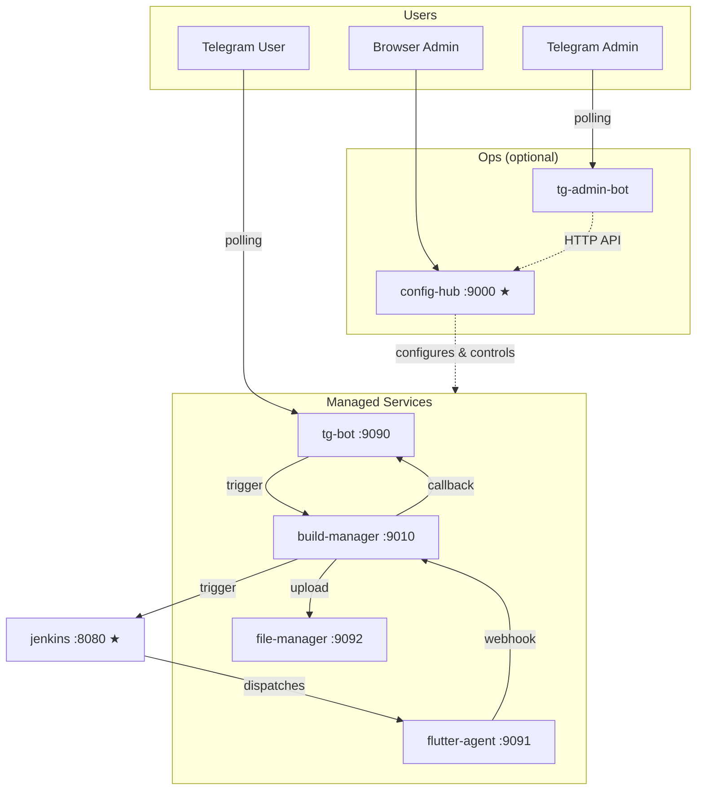

# Jenkins Flutter Bot — AI Agent Guide

This is the core architectural reference for the **jenkins-flutter-bot** monorepo, which implements a microservice architecture. It loads on every interaction. For detailed guidance on specific topics, see the companion rule files.

---

## What This Project Is

A self-hosted microservice CI/CD ecosystem: a Telegram bot triggers Flutter builds on Jenkins and delivers APKs through Google Drive. Seven containerized microservices coordinate over an internal Docker network.

**It is NOT a build system.** It is a thin orchestration layer around Jenkins. All cloning, compiling, and artifact packaging is delegated to a Jenkins pipeline running on a Flutter-capable agent.

---

## Repository Layout

The monorepo uses a **uv workspace** to manage its microservices, with two top-level directories for code:

- **`apps/`** — Seven deployable Python applications, each with a Dockerfile, `pyproject.toml`, and `src/<package>/` layout.
- **`libs/`** — One shared workspace library consumed by the apps.
- **`infra/`** — Docker Compose files, Dockerfiles, and per-service environment file templates.
- **`scripts/`** — Developer utilities (env example generation, version tagging).

### Apps

| Directory | Package | Role |
|-----------|---------|------|
| `tg-jenkins-bot` | `tg_jenkins_bot` | Telegram bot — slash commands, webhook callback, notification rendering |
| `config-hub` | `config_hub` | Central operational hub — config proxy, service control, web dashboard |
| `build-manager` | `build_manager` | Build orchestration — Jenkins trigger, job/state tracking |
| `file-manager` | `file_manager` | Storage backend — Google Drive OAuth, APK upload/download |
| `tg-admin-bot` | `tg_admin_bot` | Headless Telegram admin bot — HTTP client to config-hub |
| `agent-control` | `agent_control` | HTTP control wrapper for the Jenkins agent subprocess |
| `mock-jenkins` | `mock_jenkins` | Dev/test mock — simulates Jenkins + agent-control APIs |

### Libs

| Directory | Package | Role |
|-----------|---------|------|
| `config-core` | `config_core` | `BootstrapSettings` / `ServiceSettings` Pydantic bases, `get_frontend_schema()`, shared config I/O helpers |

### Naming Conventions

- **Directory names**: `kebab-case` (e.g., `tg-jenkins-bot`, `config-hub`).
- **Python packages**: `snake_case` matching the directory name (e.g., `tg_jenkins_bot`, `config_hub`).
- **Source layout**: All apps and libraries use PyPA `src` layout — code lives under `src/<package_name>/`.

---

## Architecture

### Service Topology

Seven services on a shared Docker bridge network. Only Jenkins and config-hub are exposed to the host:

### Service Roles

| Service | Port | Exposed | Role |
|---------|------|---------|------|
| `config-hub` | 9000 | Yes | Central operational hub — config proxy, service control, web dashboard |
| `jenkins` | 8080 | Yes | Standard Jenkins controller (dev/testing — can be external) |
| `tg-bot` | 9090 | No | Telegram polling bot + FastAPI callback/control server |
| `flutter-agent` | 9091 | No | Jenkins inbound agent with Flutter/Android SDKs + control API |
| `file-manager` | 9092 | No | Storage backend — Google Drive OAuth, APK upload/download |
| `build-manager` | 9010 | No | Build orchestration — Jenkins trigger, job state tracking |
| `tg-admin-bot` | — | No | Headless Telegram admin bot — pure HTTP client to config-hub |

### Design Principles

1. **Thin Trigger Layer** — The bot owns zero build logic. It delegates build requests to the build-manager, which triggers Jenkins via REST. All cloning, compiling, and packaging happens in the Jenkins pipeline.

2. **Centralized Operations** — `config-hub` is the single entry point for all configuration, service control, and Drive OAuth. It proxies `/control/*` calls to each owning service. Other consumers (`tg-admin-bot`) interact via its HTTP API — no direct library dependencies or volume mounts needed.

3. **No Docker-out-of-Docker** — `docker.sock` is never mounted into any container. This is intentional for security and portability.

4. **FastAPI Everywhere** — All service APIs use FastAPI, structured per the official [Bigger Applications](https://fastapi.tiangolo.com/tutorial/bigger-applications/) pattern: `main.py` (app factory) → `dependencies.py` (`Depends` + `Annotated`) → `routers/` (`APIRouter` per domain). See `coding-conventions.md` for the module table. The `tg-admin-bot` is the only exception — it runs as a Telegram polling bot with no HTTP server.

5. **Jenkins-Synced, Bot-Scoped** — The bot tracks only builds it triggered. Build state is maintained in the build-manager; the bot's local state is limited to what it needs for webhook matching and inline message editing. No information about non-bot-triggered builds is ever exposed to Telegram.

6. **uv Workspace** — Single `pyproject.toml` + `uv.lock` at the root. All members share a unified lockfile. Shared code lives in `libs/`. Dev tools are declared once at the workspace root. The flutter-agent Dockerfile keeps uv in runtime (exception — the base image lacks Python 3.12).

7. **Hub-and-Spoke Management** — `config-hub` (web dashboard + API) is the central hub. `tg-admin-bot` (headless Telegram bot) is a lightweight spoke that proxies all operations through `config-hub`'s HTTP API. The admin bot has no config volume mounts and no library dependencies on operational logic.

8. **Pydantic Configuration** — Two base classes from `config-core` partition the configuration by lifecycle: `BootstrapSettings` (env-only, hard crash at startup) for services with no dashboard-editable state (`config-hub`, `tg-admin-bot`), and `ServiceSettings` (JSON > env, soft fail) for services whose config is editable via the web UI. All `ServiceSettings` fields are visible in the dashboard. Config is hardcoded to `/app/data/<service>.json` in each module — no path configuration needed.

9. **Scope = Service Name** — `config-hub` exposes UI scope names (`bot`, `agent`, `file_manager`, `builds`) that map directly to their `ServiceClient` service names. This mapping lives in `config-hub/manager.py:_SCOPE_TO_SERVICE` as a seam for future divergence. Unknown scopes are rejected with HTTP 404.

---

## Hard Constraints

These are architectural boundaries. Do not violate them.

1. **Do NOT mount `docker.sock`** into any container.
2. **Do NOT add build logic** to the Telegram bot or config-hub — builds happen in Jenkins pipelines.
3. **Do NOT bypass the config precedence chain** — always use the service's own `ServiceSettings.load()` or `BootstrapSettings.load()` method.
4. **Do NOT expose bot, agent, file-manager, or build-manager ports to the host** — only `jenkins:8080` and `config-hub:9000` are host-facing.
5. **Do NOT use synchronous blocking I/O** in async code paths without wrapping with `asyncio.to_thread()`.
6. **Do NOT store secrets in code or Dockerfiles** — use env vars, `.env`, or service JSON config files.
7. **Do NOT replace deep merge with full overwrite** in config save logic.
8. **Do NOT leak non-bot build info to Telegram** — the bot strictly filters to its own triggered builds (matched by `BOT_REQUEST_ID`). No build counts, build numbers, or metadata from manual Jenkins triggers may appear in Telegram messages.
9. **Do NOT rename `file-manager` internals to `drive`** — the service is storage-backend agnostic. The `drive` name appears only in user-facing labels (UI text, help strings) — the config scope key is `file_manager`.

---

## Future Extensibility

The architecture supports these evolutions without structural changes:

- **External Jenkins** — the `jenkins` service in docker-compose is a **development/testing convenience**. In production, point `JENKINS_URL` to an external Jenkins instance and remove the `jenkins` service.
- **Multiple agents** — add more agent services with different `JENKINS_AGENT_NAME` values.
- **Additional storage backends** — file-manager is designed to support backends beyond Google Drive. Add a new backend under `file_manager/backends/`.
- **Additional build targets** — iOS, web, etc. The bot just needs the artifact file and metadata from the webhook.
- **Notification channels** — the build completion handlers can extend to Slack, email, etc.
- **Additional shared libraries** — add new packages under `libs/` and they are automatically picked up by the workspace via the `libs/*` member glob.
