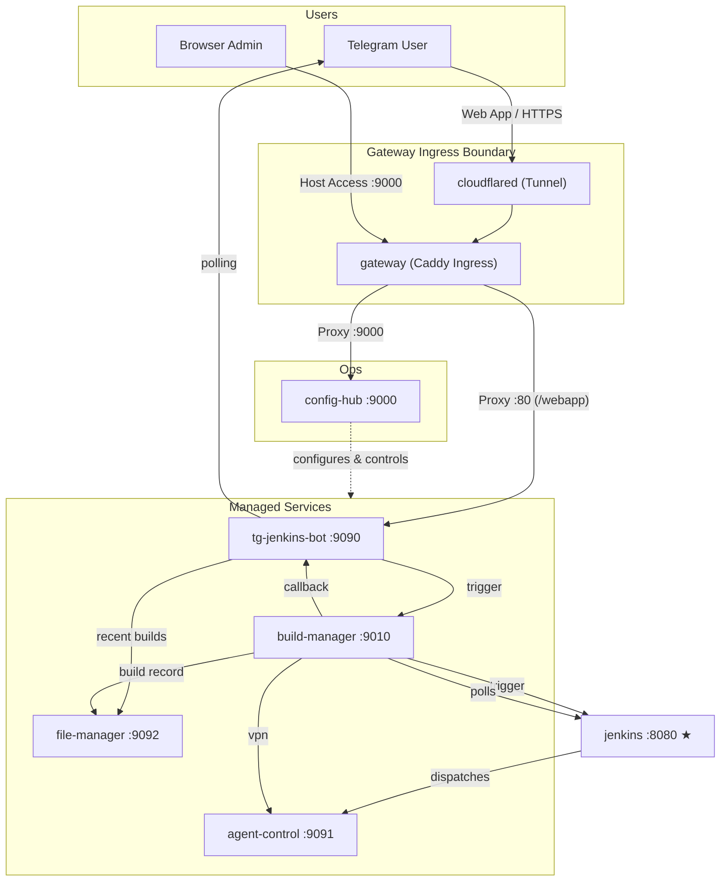

# Jenkins Flutter Bot — AI Agent Guide

Core architectural reference for the **jenkins-flutter-bot** monorepo CI/CD ecosystem.

---

## Project Overview

A self-hosted microservice CI/CD ecosystem: a Telegram bot triggers Flutter builds on Jenkins and delivers APKs through Google Drive. The system is a thin orchestration layer; compilation/packaging is fully delegated to Jenkins running on a Flutter-capable agent.

---

## Repository Layout (uv Workspace)

- **`apps/`** — Six containerized Python apps (Dockerfile, `pyproject.toml`, PyPA `src` layout).
- **`libs/`** — One shared workspace library (`config-core`).
- **`infra/`** — Docker Compose environments (`dev`, `prod`, `edge`, `hybrid`, `mock`), Dockerfiles, and env templates.
- **`scripts/`** — Developer utilities.

### Naming Conventions
- **Directories**: `kebab-case` (e.g., `tg-jenkins-bot`, `config-hub`).
- **Packages**: `snake_case` (e.g., `tg_jenkins_bot`, `config_hub`).
- **Source Layout**: Code lives under `src/<package_name>/`.

---

## Architecture & Service Topology

Six backend services and two utility containers on a shared Docker bridge network. Both public Web App traffic and administrative/host-local traffic are secured behind a Caddy Ingress Gateway:

### Service Roles

| Service | Port | Exposed | Role |
|---------|------|---------|------|
| `config-hub` | 9000 | No | Central operational hub — config proxy, service control, web dashboard (accessed via gateway) |
| `jenkins` | 8080 | Yes | Standard Jenkins controller (dev/testing — can be external) |
| `tg-jenkins-bot` | 9090 | No | Telegram polling bot + FastAPI callback/control server |
| `agent-control` | 9091 | No | Jenkins inbound agent with Flutter/Android SDKs, OpenVPN management + control API |
| `file-manager` | 9092 | No | Storage backend — Google Drive OAuth, build log, retention enforcement, ephemeral storage |
| `build-manager` | 9010 | No | Build orchestration — Jenkins trigger, job state tracking |
| `gateway` | 80, 9000 | Yes | Caddy Ingress Gateway — secure routing perimeter for public Web App (:80) and admin UI (:9000) |
| `cloudflared` | — | No | Cloudflare Tunnel — secure HTTPS tunnel connecting local gateway to Cloudflare |

---

## Design Principles

1. **Thin Trigger Layer**: The bot delegates build requests to the build-manager, which triggers Jenkins via REST.
2. **Centralized Operations**: `config-hub` is the single entry point for editing configuration, Google Drive OAuth, and monitoring service lifespans. It proxies `/control/*` calls to owning services.
3. **No Docker-out-of-Docker**: `docker.sock` is never mounted into any container.
4. **FastAPI Everywhere**: All service APIs use FastAPI, structured per the official "Bigger Applications" pattern.
5. **Jenkins-Synced, Bot-Scoped**: The bot tracks only builds it triggered (using `BUILD_REQUEST_ID`). No manual Jenkins builds are leaked to Telegram.
6. **uv Workspace**: Single `pyproject.toml` + `uv.lock` at the root. Member apps share a unified lockfile.
7. **Pydantic Configuration**: Uses `BootstrapSettings` (env-only, hard crash) for `config-hub`, and `ServiceSettings` (JSON > env, soft fail, mapped to `/app/data/<service>.json` volumes) for services editable via UI.
8. **Scope = Service Name**: `config-hub` UI scope names (`bot`, `agent`, `file_manager`, `builds`) map directly to internal service clients.
9. **No-Workaround Policy**: Workarounds that mask symptoms instead of resolving core architectural problems are strictly forbidden. Always address the root cause and refactor if needed.
10. **Refactor Notification**: Explain and align refactor plans with the user before executing large-scale refactors.
11. **Config Hub Basic Authentication**: Config Hub is secured using HTTP Basic Authentication (`CONFIG_HUB_AUTH_USERNAME`/`PASSWORD`). The Drive OAuth callback (`/api/drive/oauth/callback`) is exempted to avoid cross-origin redirect credentials-stripping.
12. **Real-Time Event Streaming (SSE)**: Service status checks and Web App active builds are streamed in real time via Server-Sent Events (SSE). Streams utilize asyncio event queues or content MD5 hashing to push updates only on state mutations.
13. **SHA-256 Content-Based Cache-Busting**: Vite produces content-hashed filenames for sub-resources (JS, CSS), cached aggressively, while the entrypoint HTML revalidates (`no-cache`).
14. **Group-Only Web App Enforcements**: The Telegram Web App and its endpoints are strictly disabled in private 1-on-1 chats.
15. **User-Authorized Build Cancellation**: Only the user who originally triggered a specific build (verified via Telegram user ID correlation) is authorized to cancel it.
16. **Drive-as-Source-of-Truth Reconciliation**: On startup, file-manager reconciles its build log against actual Google Drive contents — recovering orphan files and pruning stale records.
17. **Inter-Service Bearer Token Auth**: Optional `SERVICE_AUTH_TOKEN` for defence-in-depth on internal `/control/*` and `/api/*` endpoints. Bypassed in dev/test mode.
18. **Log Redaction**: Secrets registered via `register_secret()` are automatically scrubbed from all log output. Enabled at service startup via `setup_service_logging()`.

---

## Hard Constraints

1. **Do NOT mount `docker.sock`** into any container.
2. **Do NOT add build logic** to the bot or config-hub — builds happen in Jenkins pipelines.
3. **Do NOT bypass the config precedence chain** — always use service-specific `.load()` methods.
4. **Do NOT expose internal service ports to the host** — only `jenkins:8080` and `gateway:9000`/`:80` are host-facing.
5. **Do NOT use synchronous blocking I/O** in async code paths without wrapping with `asyncio.to_thread()`.
6. **Do NOT store secrets in code or Dockerfiles** — use env vars, `.env`, or service JSON files.
7. **Do NOT replace deep merge with full overwrite** in config save logic.
8. **Do NOT leak non-bot build info to Telegram** — filter strictly to builds matching `BUILD_REQUEST_ID`.
9. **Do NOT rename `file-manager` internals to `drive`** — the backend-agnostic service uses `file_manager` as its config scope key.
10. **Do NOT use quick workarounds or temporary patches** — fix structural root causes.
11. **Do NOT secure the Google Drive OAuth callback** with Basic Authentication.
12. **Do NOT permit private chats** to access the Telegram Mini App (reject positive chat IDs).
13. **Do NOT allow unauthorized users to cancel builds** (enforce Telegram ID verification).
14. **Do NOT use static/pinned versioning for asset cache-busting** in development — enforce content-hash filenames via Vite.
15. **Do NOT log secrets in plaintext** — use `register_secret()` and `install_log_redaction()` from `config-core`.
16. **Do NOT hand off broken code** — Always validate syntax (e.g., `npm run typecheck` for frontend, running/typechecking Python for backend) before declaring a task complete.

---

## Future Extensibility

- **External Jenkins**: Swap the local container for an external URL in production.
- **Multiple Agents**: Deploy additional agent services with unique `JENKINS_AGENT_NAME` values.
- **Additional Storage/Targets/Channels**: Add backends under `file_manager/backends/`, add pipelines for other targets, or extend callback handlers to other chat platforms.
