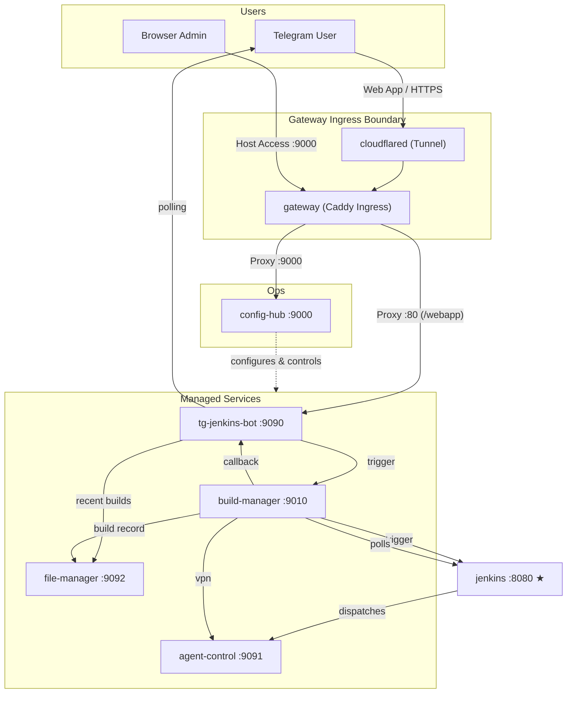

<div align="center">
  
  <h1>Jenkins Flutter Bot</h1>
  <p>A self-hosted microservice CI/CD ecosystem — Telegram triggers Flutter builds on Jenkins and delivers APKs through Google Drive.</p>

  [](https://github.com/VinhNgT/jenkins-flutter-bot/actions/workflows/build-images.yml)
</div>

---

## Architecture



| Service | Port | Exposed | Role |
|---------|------|---------|------|
| `config-hub` | 9000 | No | Central operational hub — config proxy, service control, web dashboard (accessed via gateway) |
| `jenkins` | 8080 | Yes | Standard Jenkins controller (dev/testing — can be external) |
| `tg-jenkins-bot` | 9090 | No | Telegram polling bot + FastAPI callback/control server |
| `agent-control` | 9091 | No | Jenkins inbound agent with Flutter/Android SDKs, OpenVPN management + control API |
| `file-manager` | 9092 | No | Storage backend — Google Drive OAuth, build log, retention enforcement |
| `build-manager` | 9010 | No | Build orchestration — Jenkins trigger, job state tracking |
| `gateway` | 80, 9000 | Yes | Caddy Ingress Gateway — secure routing perimeter for public Web App (:80) and admin UI (:9000) |
| `cloudflared` | — | No | Cloudflare Tunnel — secure HTTPS tunnel connecting local gateway to Cloudflare |

---

## Quick Start

```bash
git clone https://github.com/VinhNgT/jenkins-flutter-bot.git
cd jenkins-flutter-bot/infra
./compose.sh up -d --build
```

Open **http://localhost:9000** and follow the **[Setup Guide](docs/setup-guide.md)** to configure Jenkins, Telegram, and Google Drive.

> **Production:** Pre-built images are on GHCR — use `./compose.sh prod up -d`. See the setup guide for details.

---

## Apps

| App | Description | Docs |
|-----|-------------|------|
| [tg-jenkins-bot](apps/tg-jenkins-bot/) | Telegram bot — slash-command interface, notification rendering | [README](apps/tg-jenkins-bot/README.md) |
| [config-hub](apps/config-hub/) | Central operational hub — config proxy, service control, web dashboard | [README](apps/config-hub/README.md) |
| [build-manager](apps/build-manager/) | Build orchestration — Jenkins trigger, job/state tracking | [README](apps/build-manager/README.md) |
| [file-manager](apps/file-manager/) | Storage backend — Google Drive OAuth, build log, retention | [README](apps/file-manager/README.md) |
| [agent-control](apps/agent-control/) | Jenkins agent control wrapper + OpenVPN management | [README](apps/agent-control/README.md) |
| [mock-jenkins](apps/mock-jenkins/) | Dev/test mock — simulates Jenkins + agent-control APIs | [README](apps/mock-jenkins/README.md) |

## Libraries

| Library | Description | Docs |
|---------|-------------|------|
| [config-core](libs/config-core/) | Pydantic `BootstrapSettings` / `ServiceSettings` bases + declarative config framework | [README](libs/config-core/README.md) |

---

## License

This project is private. All rights reserved.

