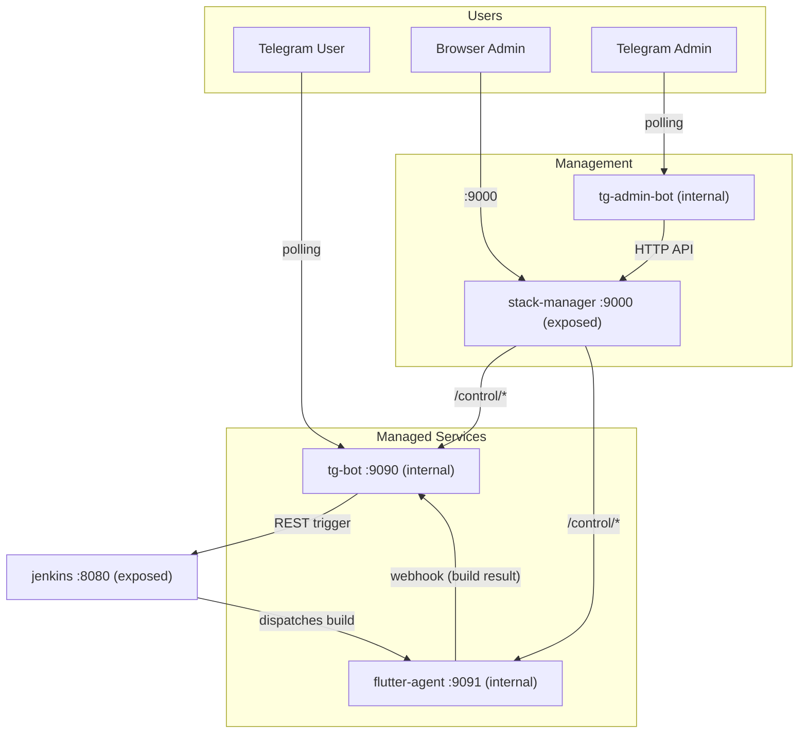

<div align="center">
  
  <h1>Jenkins Flutter Bot</h1>
  <p>A self-hosted CI/CD ecosystem — Telegram triggers Flutter builds on Jenkins and delivers APKs through Google Drive.</p>

  [](https://github.com/VinhNgT/jenkins-flutter-bot/actions/workflows/build-images.yml)
</div>

---

## Architecture



| Service | Port | Exposed | Role |
|---------|------|---------|------|
| `tg-bot` | 9090 | No | Telegram bot + webhook receiver |
| `stack-manager` | 9000 | Yes | Central operational hub — config, service control, Drive OAuth, web dashboard |
| `jenkins` | 8080 | Yes | Jenkins controller (dev/testing — can be external) |
| `flutter-agent` | 9091 | No | Jenkins agent with Flutter/Android SDKs |
| `tg-admin-bot` | — | No | Headless Telegram admin bot (HTTP client to stack-manager) |

---

## Quick Start

```bash
git clone https://github.com/VinhNgT/jenkins-flutter-bot.git
cd jenkins-flutter-bot/infra
./compose.sh up -d --build
```

Open **http://localhost:9000** and follow the **[Setup Guide](docs/setup-guide.md)** to configure Jenkins, Telegram, and Google Drive.

> **Production:** Pre-built images are on GHCR — use `./compose.sh prod up -d`. See the setup guide for details.

---

## Apps

| App | Description | Docs |
|-----|-------------|------|
| [tg-jenkins-bot](apps/tg-jenkins-bot/) | Telegram bot — build trigger + webhook receiver + Drive upload | [README](apps/tg-jenkins-bot/README.md) |
| [stack-manager](apps/stack-manager/) | Central operational hub — config, service control, Drive OAuth, web dashboard | [README](apps/stack-manager/README.md) |
| [tg-admin-bot](apps/tg-admin-bot/) | Headless Telegram admin bot — proxies to stack-manager API | [README](apps/tg-admin-bot/README.md) |
| [agent-control](apps/agent-control/) | HTTP control wrapper for the Jenkins agent subprocess | [README](apps/agent-control/README.md) |

## Libraries

| Library | Description | Docs |
|---------|-------------|------|
| [config-schema](libs/config-schema/) | Declarative `FieldDef` schema framework | [README](libs/config-schema/README.md) |

---

## License

This project is private. All rights reserved.
