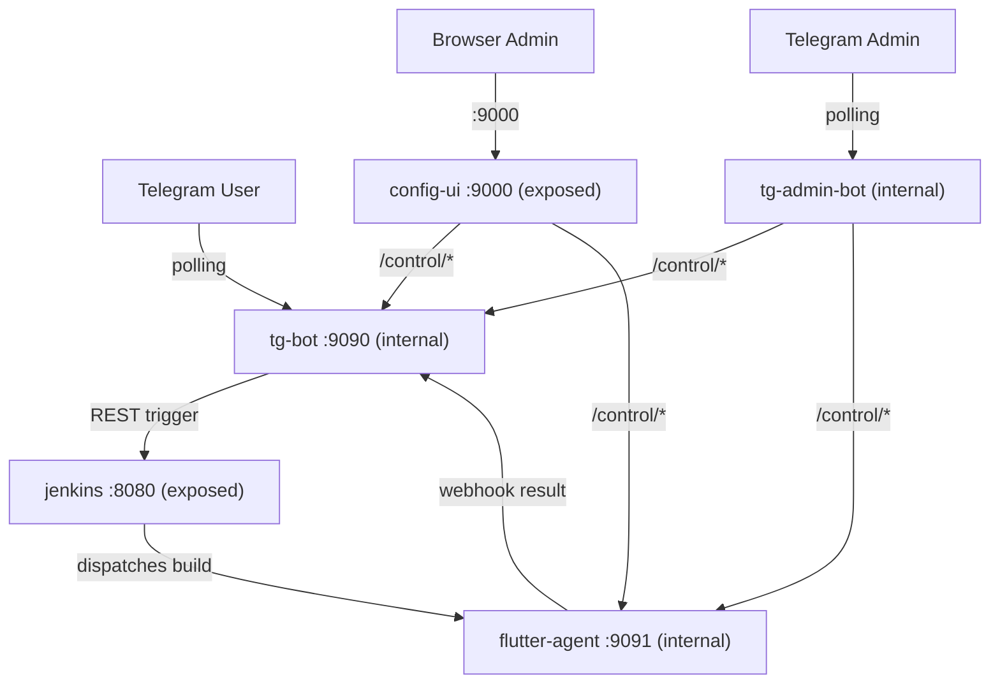

# 🏗️ Jenkins Flutter Bot — Monorepo

[](https://github.com/VinhNgT/jenkins-flutter-bot/actions/workflows/build-images.yml)

A self-hosted CI/CD ecosystem: a Telegram bot triggers Flutter builds on Jenkins and delivers APKs through Google Drive. Five containerized services coordinate over an internal Docker network.

## Repository Structure

```text
├── apps/                       Deployable applications
│   ├── tg-jenkins-bot/         Telegram bot — build trigger + webhook receiver + Drive upload
│   ├── config-ui/              Web dashboard — config CRUD, service control, Drive OAuth
│   ├── tg-admin-bot/           Headless Telegram admin bot — stack management fallback
│   └── agent-control/          HTTP control wrapper for the Jenkins agent subprocess
│
├── libs/                       Shared workspace libraries
│   ├── config-schema/          Declarative configuration schema framework
│   └── stack-manager/          Service control, Drive OAuth, env I/O, Jenkinsfile generation
│
├── infra/                      Docker Compose stack, Dockerfiles, per-service env templates
├── scripts/                    Developer utilities (env example generation, version tagging)
└── docs/                       Setup guide and documentation
```

## Apps

| App | Description |
|-----|-------------|
| [tg-jenkins-bot](apps/tg-jenkins-bot/) | Telegram bot that triggers Jenkins builds and uploads artifacts to Google Drive |
| [config-ui](apps/config-ui/) | FastAPI dashboard for managing bot/agent/Drive configuration, service control, and OAuth |
| [tg-admin-bot](apps/tg-admin-bot/) | Headless Telegram admin bot for stack management when the web dashboard is unavailable |
| [agent-control](apps/agent-control/) | HTTP control wrapper for the Jenkins inbound agent process (start/stop/status) |

## Libraries

| Library | Description |
|---------|-------------|
| [config-schema](libs/config-schema/) | Declarative `FieldDef` dataclass, `resolve_fields()`, `serialize_schema()` |
| [stack-manager](libs/stack-manager/) | Shared operational utilities — service control, Drive OAuth, config store, env I/O |

## Getting Started

📖 **See [docs/setup-guide.md](docs/setup-guide.md) for a complete step-by-step walkthrough** covering Jenkins setup, Telegram bot creation, Google Drive OAuth, and configuration.

### Quick Start

```bash
cd infra
./compose.sh up -d --build
```

This builds and starts all five services. Open the config UI at **http://localhost:9000** to configure the stack, then follow the [setup guide](docs/setup-guide.md) to complete Jenkins, Telegram, and Google Drive configuration.

> **Note:** The `jenkins` service in docker-compose is a local development/testing convenience. In production, point `JENKINS_URL` to an external Jenkins instance and remove the `jenkins` service.

### Production Deployment

Pre-built images are available on GitHub Container Registry:

```bash
cd infra
./compose.sh prod up -d                     # pull latest images
IMAGE_TAG=v1.2.3 ./compose.sh prod up -d     # pin a specific release
```

### Local Development

The repo uses a **uv workspace** with a single lockfile at the root:

```bash
# Install all workspace members
uv sync

# Run a specific app
uv run --package tg-jenkins-bot tg-jenkins-bot
uv run --package config-ui config-ui
uv run --package agent-control agent-control
```

## Architecture



| Service | Port | Exposed | Role |
|---------|------|---------|------|
| `tg-bot` | 9090 | No | Telegram polling bot + FastAPI webhook/control server |
| `config-ui` | 9000 | Yes | Web dashboard for config, service control, Drive OAuth |
| `jenkins` | 8080 | Yes | Jenkins controller (dev/testing — can be external) |
| `flutter-agent` | 9091 | No | Jenkins inbound agent with Flutter/Android SDKs + control API |
| `tg-admin-bot` | — | No | Headless Telegram admin bot for stack management |

## License

This project is private. All rights reserved.
