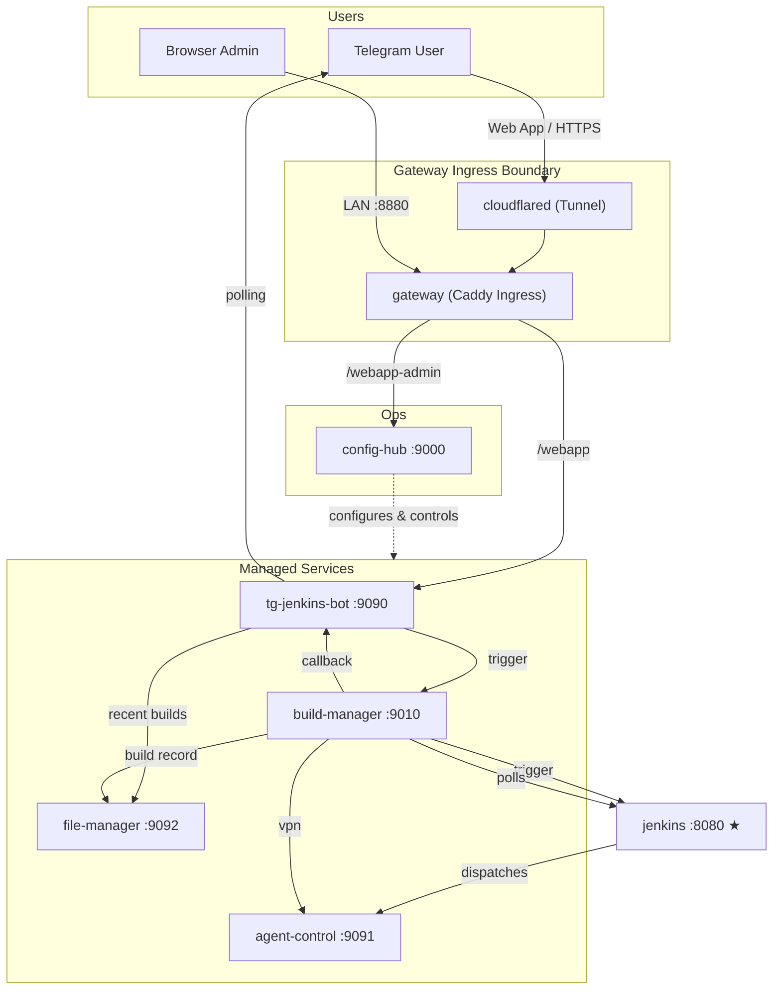

<div align="center">
  
  <h1>Jenkins Flutter Bot</h1>
  <p>A self-hosted microservice CI/CD ecosystem — Telegram Mini Apps trigger Flutter builds on Jenkins and deliver APKs through Google Drive.</p>

  [](https://github.com/VinhNgT/jenkins-flutter-bot/actions/workflows/build-images.yml)
</div>

---

## Architecture



| Service | Port | Exposed | Role |
|---------|------|---------|------|
| `config-hub` | 9000 | No | Central operational hub — config proxy, service control, and admin Mini App (accessed via gateway at `/webapp-admin`) |
| `jenkins` | 8080 | Yes | Standard Jenkins controller (dev/testing — can be external) |
| `tg-jenkins-bot` | 9090 | No | Telegram polling bot + FastAPI callback/control server |
| `agent-control` | 9091 | No | Jenkins inbound agent with Flutter/Android SDKs, OpenVPN management + control API |
| `file-manager` | 9092 | No | Storage backend — Google Drive OAuth, build log, retention enforcement, ephemeral/log_only storage |
| `build-manager` | 9010 | No | Build orchestration — Jenkins trigger, job state tracking |
| `gateway` | 80 | Yes | Caddy Ingress Gateway — unified path-based routing for `/webapp` (bot) and `/webapp-admin` (config-hub). Host maps `8880:80` in dev |
| `cloudflared` | — | No | Cloudflare Tunnel — secure HTTPS tunnel connecting local gateway to Cloudflare |

---

## Quick Start

```bash
git clone https://github.com/VinhNgT/jenkins-flutter-bot.git
cd jenkins-flutter-bot/infra
./compose.sh up -d --build
```

Open **http://localhost:8880/webapp-admin** (best-effort standalone browser support or through Telegram client) and follow the **[Setup Guide](docs/setup-guide.md)** to configure Jenkins, Telegram, and Google Drive.

> [!NOTE]
> Both frontends are designed natively as **Telegram Mini Apps** to run inside the Telegram client. Direct access via standard standalone desktop browsers is supported on a **best-effort basis only**, utilizing standard browser storage and a fallback platform provider for local development and verification.

> **Production:** Pre-built images are on GHCR — use `./compose.sh prod up -d`. See the setup guide for details.

---

## Apps

| App | Description | Docs |
|-----|-------------|------|
| [tg-jenkins-bot](apps/tg-jenkins-bot/) | Telegram bot & Mini App — slash-command interface, build triggers, notification rendering | [README](apps/tg-jenkins-bot/README.md) |
| [config-hub](apps/config-hub/) | Central operational hub — config proxy, service control, and admin Mini App | [README](apps/config-hub/README.md) |
| [build-manager](apps/build-manager/) | Build orchestration — Jenkins trigger, job/state tracking | [README](apps/build-manager/README.md) |
| [file-manager](apps/file-manager/) | Storage backend — Google Drive OAuth, build log, retention | [README](apps/file-manager/README.md) |
| [agent-control](apps/agent-control/) | Jenkins agent control wrapper + OpenVPN management | [README](apps/agent-control/README.md) |
| [mock-jenkins](apps/mock-jenkins/) | Dev/test mock — simulates Jenkins + agent-control APIs | [README](apps/mock-jenkins/README.md) |

## Libraries

| Library | Description | Docs |
|---------|-------------|------|
| [config-core](libs/config-core/) | Pydantic settings base classes, secret masking, validation utilities, and shared security/auth primitives | [README](libs/config-core/README.md) |
| [platform-core](libs/platform-core/) | Preact cross-platform settings storage, primary button context, hooks, and normalized capability adapters | — |
| [tg-core-preact](libs/tg-core-preact/) | Telegram WebApp SDK context provider, viewport sizing, and theme parameter synchronization hooks | — |
| [tg-ui-preact](libs/tg-ui-preact/) | High-fidelity Telegram UI Preact component library and stylesheet | — |

---

## License

This project is private. All rights reserved.

